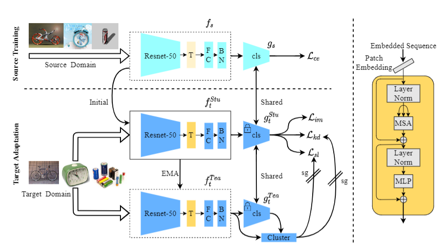
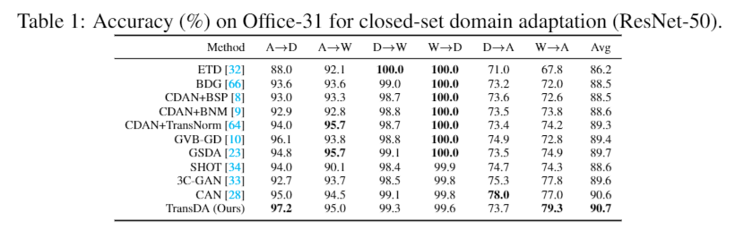
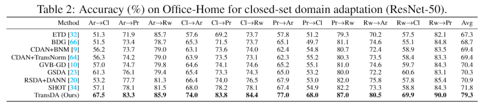

# Official implementation for TransDA
Official pytorch implement for [“Transformer-Based Source-Free Domain Adaptation”](https://arxiv.org/abs/2105.14138).
## Overview:


## Result:




## Prerequisites:
- python == 3.6.8
- pytorch ==1.1.0
- torchvision == 0.3.0
- numpy, scipy, sklearn, PIL, argparse, tqdm

## Prepare pretrain model
We choose R50-ViT-B_16 as our encoder.
```bash root transformerdepth
wget https://storage.googleapis.com/vit_models/imagenet21k/R50+ViT-B_16.npz 
mkdir ./model/vit_checkpoint/imagenet21k 
mv R50+ViT-B_16.npz ./model/vit_checkpoint/imagenet21k/R50+ViT-B_16.npz
```
Our checkpoints could be find in [Dropbox](https://www.dropbox.com/sh/vost4yt3c2vuuec/AAAHEszAwM4ZTA-BxRe6_9p2a?dl=0)
## Dataset:
- Please manually download the datasets [Office](https://www.dropbox.com/sh/vja4cdimm0k2um3/AACCKNKV8-HVbEZDPDCyAyf_a?dl=0), [Office-Home](https://www.dropbox.com/sh/vja4cdimm0k2um3/AACCKNKV8-HVbEZDPDCyAyf_a?dl=0), [VisDA](https://github.com/VisionLearningGroup/taskcv-2017-public/tree/master/classification), [Office-Caltech](https://www.dropbox.com/sh/vja4cdimm0k2um3/AACCKNKV8-HVbEZDPDCyAyf_a?dl=0) from the official websites, and modify the path of images in each '.txt' under the folder './data/'.
- The script "download_visda2017.sh" in data fold also can use to download visda
## Training
### Office-31
    ```python
    sh run_office_uda.sh
    ```
### Office-Home
    ```python
    sh run_office_home_uda.sh
    ```
### Office-VisDA
    ```python
    sh run_visda.sh
    ```
# Reference

[ViT](https://github.com/jeonsworld/ViT-pytorch)

[TransUNet](https://github.com/Beckschen/TransUNet)

[SHOT](https://github.com/tim-learn/SHOT)
